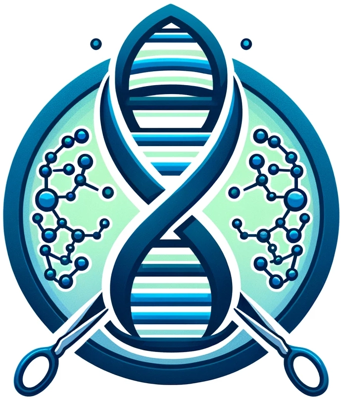

#  **DeepChopper** [](https://github.com/ylab-hi/DeepChopper/stargazers)

<!--toc:start-->

- [Feature](#feature)
- [🤜 Contribution](#%F0%9F%A4%9C-contribution)

<!--toc:end-->

Language models identify chimeric artificial reads in NanoPore direct-RNA sequencing data.
DeepChopper leverages language model to accurately detect and chop these aritificial sequences which may cause chimeric reads, ensuring higher quality and more reliable sequencing results.
By integrating seamlessly with existing workflows, DeepChopper provides a robust solution for researchers and bioinformaticians working with NanoPorea direct-RNA sequencing data.

## Install

## Usage

```bash
deepchopper predict --input <input> --output <output>
```

```bash
deepchopper chop --input <input> --output <output>
```

## Cite

## 🤜 Contribution

**Build Environment**

```bash
git clone https://github.com/ylab-hi/DeepChopper.git
cd DeepChopper
conda env create -n environment.yaml
conda activate deepchopper
```

**Install Dependencies**

```bash
pip install pipx
pipx install --suffix @master git+https://github.com/python-poetry/poetry.git@master
poetry@master install
```
